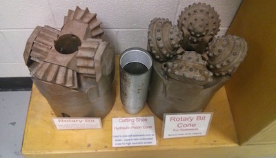

# Open Core Data Documentation 

### About


This is the start of the Open Core Data documnetation in markdown




[Architecture](./Architecture.md)


### RE3 citation

http://service.re3data.org/repository/r3d100012071 

Citation:

```
re3data.org: Open Core Data; editing status 2016-07-27; 
re3data.org - Registry of Research Data Repositories. 
http://doi.org/10.17616/R37936 last accessed: 2016-08-25
```


### OutReach

* CSDCO Science Meeting
* LacCore Developer meeting (Madison) 
* LacCore drilling institute
* Linked Earth meeting
* C4P Hackathon
* EarthCube All Hands
* ESIP Summer meeting (North Carolina)

### Community connections

In order to enhance the impact of scientific drilling and core data, opencoredata.org will work with domain-specific data management efforts to ensure that drilling results can be easily discovered and harvested by these external systems. This will allow specific subsets of IODP and CSDCO data (e.g. paleobiology, geochemistry, sedimentology, paleomagnetics, etc.) to gain visibility in domain-specific data systems serving their communities of scientists, including many who are not traditional users of drilling data, and integrate the results of scientific drilling projects with relevant related data for enhanced analysis and cross-disciplinary research.

Diary of interaction with the following groups:

* Fly Over Country

* Neotoma

* Gplates

* GeoLink

* Magic


### Citation

### Provenance 

### APIs

### Semantics

### Notebook development

### Formats

### Metadata approaches

