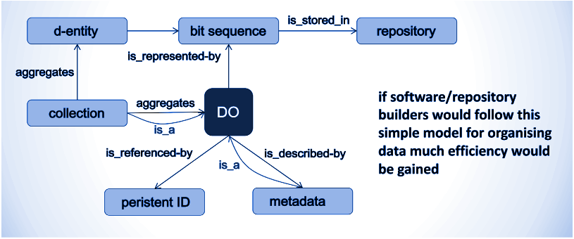
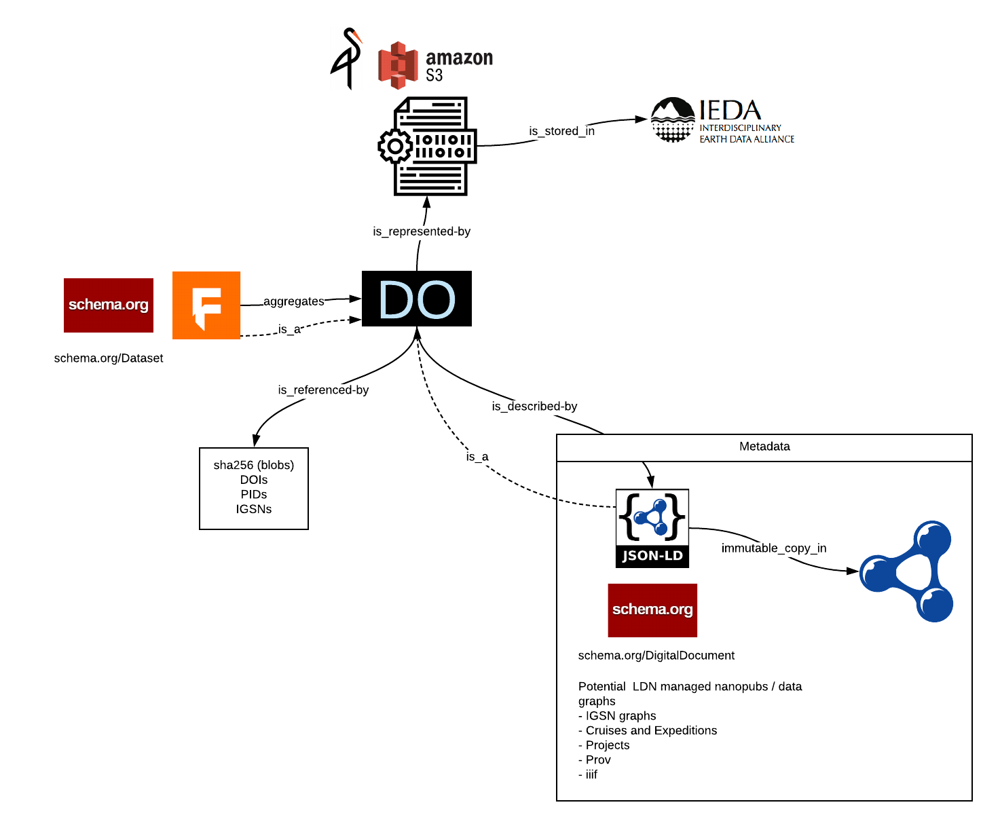
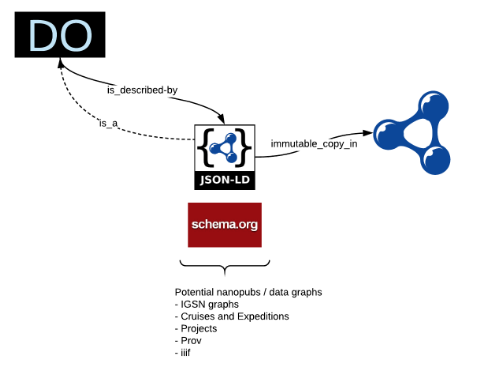
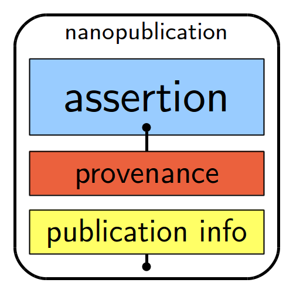
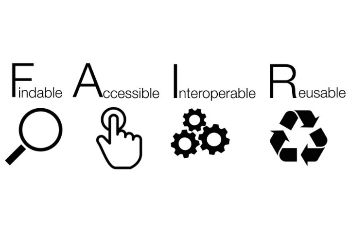

# Open Core Data

## A Digital Object Architecture supporting FAIR patterns for scientific drilling data

Open Core Data (OCD) has been prototyping approaches to a scalable and easy to maintain architecture to expose scientific drilling data and to provide a pattern for the sharing of related data.   The result of this work and research has arrived at the following key features

1. Guidance based around FAIR principles as advocated by AGU Enabling Fair Data (<http://www.copdess.org/enabling-fair-data-project/>)
2. Digital Object Architecture 
3. Data in Context through semantics

The Open Core Data pattern is open by design and the digital object pattern means it can act as a digital object store to external services.  This means that communities in a scientific drilling community can call and extend the objects locally.  This approach is under discussion with Magic, Site Survey and Neotoma among others.  The approach is not a single monolithic pattern but a distributed one allowing communities of practice with domain expertise to focus on value add activities while pulling objects and graph elements necessary either dynamically over the net or pulled locally.   Local copies retain their provenance and links to their canonical authority.

This approach implements the patterns of a global digital object cloud as defined in the Research Data Alliance (RDA)  references below. 

Open Core Data has brought both IODP and CSDCO data holdings together at opencoredata.org using a mix of local and community ontologies.  These data have then be exposed following open data and LOD patterns with machine readable metadata and CSV for the Web (ref) data formats.  A collection of API’s have been developed to allow use of this data in notebook environment like Jupyter and R which include spatial elements.

References:  

[@FAIR]: Enabling Fair Data Project <http://www.copdess.org/enabling-fair-data-project/> 

[@OpenScience]:  Open Science by Design
<https://www.nap.edu/catalog/25116/open-science-by-design-realizing-a-vision-for-21st-century>

[@ObjCloud]; RDA Digital Object Cloud: <https://rd-alliance.org/group/data-fabric-ig/wiki/global-digital-object-cloud>

[@DDPIG]: Data Discovery Paradigms Interest Group <https://www.rd-alliance.org/groups/data-discovery-paradigms-ig>

[@CommPrac]: Common Practices in Revolutionary Infrastructures and Data <https://b2share.eudat.eu/records/4e8ac36c0dd343da81fd9e83e72805a0>


## Digital Object Architecture 

The basic storage and reference approach is built around the a Digital Object Pattern as defined by the various references in this documents.    This pattern has also been adopted as the new pattern being developed by the *Biological and Chemical Oceanography Data Management Office* (*BCO-DMO*).   This work is being done in collaboration with Open Core Data now and is being co-developed by Fils and Shepherd.  

The pattern is defined by the figure 1 below.  



Figure 1: Basic Digital Object Pattern (Credit RDA  (exact document needs to be found))

The OCD implementation of this pattern is defined in figure 2 in the following section.  The DO pattern suggest that even the metadata data for a given object is also stored as an object.  So, for example, a core description document is stored as a given object with an ID and its metadata then is another digital object with yet another ID.   

In the OCD pattern then, these metadata objects are stored as graphs (RDF data model) encoded in JSON-LD.  These are then loaded into a triple store that allow for query and API development on top of this graph.   

Also, packages of objects can then be assembled together into data sets.  These data sets are also object stored in the object store system.  To address this OCD has implemented Frictionless Data Packages (@FDP) 

All three objects (file, metadata, package) use the same system for storage and access and one common graph data model for query and access.   

References:

[@GEDE]: GEDE Digital Object Topic Group <https://www.rd-alliance.org/group/gede-group-european-data-experts-rda/wiki/gede-digital-object-topic-group>

### Object Storage Implementation

The basis of the object storage is around Minio [@Minio] which is an open source S3 API implementation.   Minio is a high performance and scalable object storage system.  It also support S3 Select API [@S3Select] for query across tabular data objects.



Figure 2:  OCD implementation of DO pattern

### Metadata

Following the DO pattern and detailed up and broken out below the metadata data objects are also stored as objects in the system.  The metadata follows the RDA PID pattern and also is inspired by the W3C DID recommendations.   The metadata is in a RDF format and serialized in JSON-LD.  See appendix for example record for simple object metadata.  Note this is only an object metadata record and not a package metadata record.  



### Packaging

Digital object can take many forms.  At a basic level they can be simple objects or meta-data objects.  In addition to these, object can and should be packaged into collections.  These collections should also be objects defined as virtual collections of other objects.  

Open Core has selected Frictionless Data Packages [@FDP] as the reference package model.  This is combined with BagIt as an archival package.   FDP package have an extensive set of available tools (ref: <https://frictionlessdata.io/software/>).   FDP also allows for a packaging by reference.  Packages can be defined by references to the digital objects.   This allows virtual packages to be defined that 

### Object Work Flow

The S3 API based object store combined with objects and packages allows for easy work flows.  An example of this has been defined in the source package ObjectEngine (git reference here).  It takes objects and processes them through Apache Tika.  Tika extracts text file files (images, PDF, office, movies, etc).   The results of this are then feed into the metadata graph to allow free text search file contents.    This also lays the foundation for machine learning work flows which could leverage this or other similar work flows.  

### Architecture

The details of the architecture are beyond this document.  However, a brief overview is warranted.   The system is based on Docker containers and runs on the XSEDE data services. 

## Data Annotation and Notification

Open Core is implementing a Linked Data Notification (LDN) system [@LDN] .  This is focused on providing annotation following W3C  Annotation [@W3CAnnotation] .   LDN provides an open and standards based approach to annotations and provenance.  It is also a key element of the MIT SOLID project as well.    



<https://github.com/fils/GoLDeN>

## Semantics 
A key facet of the Open Core development is the integration of Semantics.   Semantics is the key element
necessary to realize the Interoperability and Reusability element of FAIR data principles.   

During the development process of OCD an opportunity arose to work on what became Project 418 (P418) through the
NSF EarthCube program.  Additionally, P418 developers (Fils, Shepherd) became aware of and communicated with the 
team at Google Research who were developing what would become the Google Dataset Search Tool.

Several sessions and presentation were held at ESIP and AGU (refs).  From these several additional connections 
and projects arose.  Including:

* ESIP Science on Schema 
  * <https://github.com/ESIPFed/science-on-schema.org>
  * <https://geoschemas.org/>
* A follow on Project 419 (in progress now) 


### schema.org extensions

Schema.org is a means to synthesize and align multiple data models.  The base dataset type for schmea.org is found at <https://schema.org/Dataset> .   It is derived from DCAT and there is a work underway to align better schema.org and DCAT.   

However, neither of these is expressive enough to define domain specific goals such as paleomagnetics or geochemistry  concepts.   The authors of schema.org were well aware that the core schema.org only served to as a base upper level set of concepts.   Built into schema.org is a rich extension model that allows the creation and connection of domain specific vocabularies.  

### EarthCube Project 418
Project 418 is an ESSO-managed pilot project which addresses some of EarthCube's
core activities envisioned for the EarthCube Cyberinfrastructure. These activities
include Resource Registration, Data Discovery, and Data Access. Project 418 will serve
as a pilot for the beginning point for these tasks, provide a foundation for future
initiatives, as well as become a core component linking data facilities and EarthCube
funded projects.


https://www.earthcube.org/p418


### Google Dataset Search

The recently announced Google Data Search Tool [1] [2] demonstrates the use of Schema.org [3] and web architecture patterns by the leading commercial sector search provider to address scientific data set discovery.   Noteable is Google’s use of open and web architecture based approaches to achieve this.  

The Schema.org vocabulary is a open and collaborative community of commercial and other participants.  It is a broad and general schema but has built in extensibility to enable detailed domain specific capacity, among them, data sets.  

The EarthCube ESSO Project 418 set out to leverage schema.org and the web architecture to the address Earth science data set discovery.  Project 418 directly engaged 10 NSF data facilities to employ this pattern and test its use.  During this, Project 418 was aware of and in communication with Google and others across the Earth science community (ESIP, RDA, ESSI and others)  to ensure alignment of recommendations and to leverage existing work and experience.   Project 418’s material is openly available on GitHub [6] and provides documentation on publishing, vocabulary work and extensive code and examples for accessing, indexing and searching exposed structured metadata.    A notable quote from Google’s announcement is 

> *“A search tool like this one is only as good as the metadata that data publishers are willing to provide.”* 
>
> Natasha Noy  Ref [1]

A key focus of Project 418 was on extending the vocabulary aspect of this approach to address the needs of the Earth science community and provide enhanced capabilities around domain specific needs of the various scientific disciplines.

[1] *Making it easier to discover datasets*. (2018). *Google*. Retrieved 7 September 2018, from <https://www.blog.google/products/search/making-it-easier-discover-datasets/> 

[2] (2018). *Toolbox.google.com*. Retrieved 7 September 2018, from <https://toolbox.google.com/datasetsearch> 

[3] *Home - schema.org*. (2018). *Schema.org*. Retrieved 7 September 2018, from <https://schema.org/> 

### EarthCube Project 419 

The follow on work for 418 will focus on data services (services that expose data) and also time based data including data defined by geologic time.   P419 is in communication with the PaleoMagnetics service Magic to demonstrate these and is also working with IODP Site Survey on approaches to shared resource identifiers to align data across various data system.  


### ESIP Science on Schema
During the development of P418 a key element identified was the need for a geoscience ontology.
P418 developers were aware of the ESIP SWEET ontology but it currently lacks alignment with schema.org.

In collaboration with ESIP the EarthCube vocabulary elmenent developed as part of P418 was transfered
to ESIP as the Science on Schema work.  This will become GeoSchemas in a concept parallel to the BioSchemas
work taking place in Europe.  

This vocablary will also be used as part of P419 and will extended to address issues of temporal datasets
and also date services that are mediated by RESTful web services.  

NOTE:  The temporal aspect will include geologic time based on both Ma and BP temportal systems.  Initially 
the Ma aspect was the only element present but requests by P418/419 developers to W3C and OGC governance has
been favorable and looks to establish BP quickly.  

P419 will develop patterns for the publishing of geologic (and present day) data with semantic temporal elements
leveraging CSIRO work in Geologic time and W3C OWL Time standards.  

### Community defined constraints

The nature of the graph data model used in these approaches has the potential to lead to valid yet different approaches
to representing data.  This was surfaced in the P418 pilot work.  The result exposed an issue that resulted in 
complex query requirements on data users.  

To address this P419 is testing the implementation of W3C SHACL shape constraints.   These "shape graphs" are small
and easy to develop and allow a community to define how certain concepts are represented in graphs.

For example, a SHACL shape graph can allow a community of researchers to define how they wish to represent 
funding sources, geologic time, citation information, sample identifiers or a whole ranege of concepts of relevance
to their domain.   Using these then an automated system for testing comliance is in testing 


ref: https://github.com/fils/shaclservice and <https://www.w3.org/TR/shacl/> 

### OBO Foundry 
To simplify the development and deployment of a vocabulary a dialog with the 
Open Biological and Biomedical Ontology (OBO) Foundry has begun.   Though started in the bio community the work 
has been generalized to allow many domains to leverage the work.  The ocean science community in particular
has been collaborating with OBO for some time.   Also, recently ESIP has been aliging the cryosphere concepts
from SWEET with OBO Foundary.  

Based on this initial work on a revised scientific drilling ontology is in development.  Leveraging the 
OBO ontology SDK to better facilitate cross walks on other semantic vocabularies.

http://www.obofoundry.org/

### Other activities
* BioSchemas as an example community in the Bio community we are communicating with
* DCAT alignment with schema.org
* W3C and OGC time reference systems including Ma and BP (requested)


## FAIR Data



### AGU Enabling FAIR Data

Mention here connections to AGU Enabling FAIR data work.

How can we help address “F” in a scalable, standards based and easy to implement manner?

### Findable

This includes assigning a persistent identifier (like a [DOI](https://www.ands.org.au/guides/doi) or [Handle](https://www.ands.org.au/guides/identify-my-data)), having rich [metadata](https://www.ands.org.au/working-with-data/metadata) to describe the data and making sure it is findable through disciplinary discovery portals (local and international).

Australian National Data Service


> F1. (meta)data are assigned a globally unique and eternally persistent identifier.
> F2. data are described with rich metadata.
> F3. (meta)data are registered or indexed in a searchable resource.
> F4. metadata specify the data identifier.

### Accessible

This may include making the data open using a standardised protocol. However the data does not necessarily have to be open. There are sometimes good reasons why data [cannot be made open](https://www.ands.org.au/working-with-data/sensitive-data), for example privacy concerns, national security or commercial interests. If it is not open there should be clarity and transparency around the conditions governing access and reuse.

Australian National Data Service


> A1  (meta)data are retrievable by their identifier using a standardized communications protocol.
> A1.1 the protocol is open, free, and universally implementable.
> A1.2 the protocol allows for an authentication and authorization procedure, where necessary.
> A2 metadata are accessible, even when the data are no longer available.


### Interoperable

To be interoperable the data will need to use community agreed formats, language and [vocabularies](https://www.ands.org.au/guides/vocabularies-and-research-data). The metadata will also need to use a community agreed standards and vocabularies, and contain links to related information using [identifiers](https://www.ands.org.au/working-with-data/citation-and-identifiers).

Australian National Data Service

> I1. (meta)data use a formal, accessible, shared, and broadly applicable language for knowledge representation.
> I2. (meta)data use vocabularies that follow FAIR principles.
> I3. (meta)data include qualified references to other (meta)data.


### Reproducable

Reusable data should maintain its initial richness. For example, it should not be diminished for the purpose of explaining the findings in one particular publication. It needs a clear machine readable [licence](http://www.ands.org.au/working-with-data/publishing-and-reusing-data/licensing-for-reuse) and [provenance](https://www.ands.org.au/partners-and-communities/ands-communities/data-provenance-interest-group) information on how the data was formed. It should also have discipline-specific data and metadata standards to give it rich contextual information that will allow for reuse.

Australian National Data Service

> R1. meta(data) have a plurality of accurate and relevant attributes.
> R1.1. (meta)data are released with a clear and accessible data usage license.
> R1.2. (meta)data are associated with their provenance.
> R1.3. (meta)data meet domain-relevant community standards.

## Sample Identifiers

The section is not yet developed.  We are working with IGSNs and have developed a means to integrate them into the object architecture and the knowledge graph for query.  


## Services and Interfaces

### API maintance

The section is not yet developed.  

* Talk about GraphQL and graphs here...
* issues with maintaining APIs but also with aligning graphql to graph model.  
* potential for shacl -> graphql.

### Web Components

The section is not yet developed.  


------

## References

[@LDN]: http://dx.doi.org/10.1002/aris.201 Data sharing in the sciences

[@W3CAnnotation]:  https://www.w3.org/annotation Web Annotation Working Group 

[@BioSchema]: https://bioschemas.org

[@FDP]: Frictionless Data Packages <https://frictionlessdata.io/> 

[@S3Select] https://docs.min.io/docs/minio-select-api-quickstart-guide.html

------

## Appendix

### Example Object metadata record

```
[
 {
  "@graph": [
   {
    "@id": "_:bbj6s49vtr9b9lop9n40g",
    "@type": [
     "http://schema.org/PropertyValue"
    ],
    "http://schema.org/propertyID": [
     {
      "@value": "SHA256"
     }
    ],
    "http://schema.org/value": [
     {
      "@value": "e88c1fa53004f75e2f1a761284c42e22d69e1750e70904c02c0b726ff42250ad"
     }
    ]
   },
   {
    "@id": "http://opencoredata.org/id/do/bj6s49vtr9b9lop9n40g",
    "@type": [
     "http://www.schema.org/DigitalDocument"
    ],
    "http://schema.org/additionType": [
     {
      "@id": "http://opencoredata.org/voc/csdco/v1/ICDFiles"
     }
    ],
    "http://schema.org/dateCreated": [
     {
      "@value": "2009-11-02"
     }
    ],
    "http://schema.org/description": [
     {
      "@value": "Digital object of type ICD named YNP3-ABD09-1A-1L-1.pdf for CSDCO project YNP3"
     }
    ],
    "http://schema.org/encodingFormat": [
     {
      "@value": "application/pdf"
     }
    ],
    "http://schema.org/identifier": [
     {
      "@id": "_:bbj6s49vtr9b9lop9n40g"
     }
    ],
    "http://schema.org/isRelatedTo": [
     {
      "@value": "YNP3"
     }
    ],
    "http://schema.org/license": [
     {
      "@id": "http://example.com/cc0.html"
     }
    ],
    "http://schema.org/name": [
     {
      "@value": "YNP3-ABD09-1A-1L-1.pdf"
     }
    ],
    "http://schema.org/url": [
     {
      "@id": "http://opencoredata.org/id/do/e88c1fa53004f75e2f1a761284c42e22d69e1750e70904c02c0b726ff42250ad"
     }
    ]
   }
  ],
  "@id": "http://opencoredata.org/objectgraph/id/e88c1fa53004f75e2f1a761284c42e22d69e1750e70904c02c0b726ff42250ad"
 }
```

