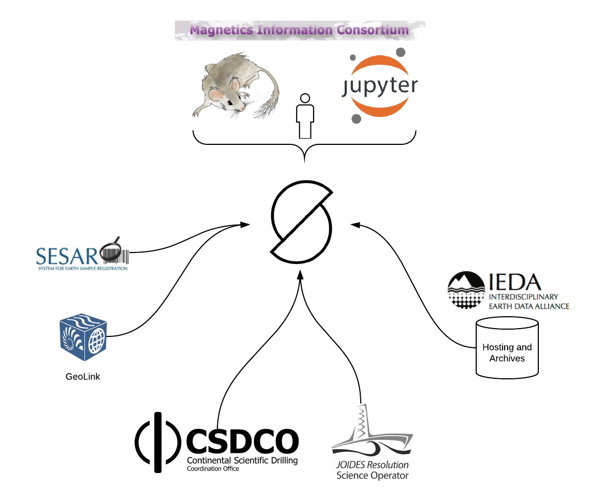
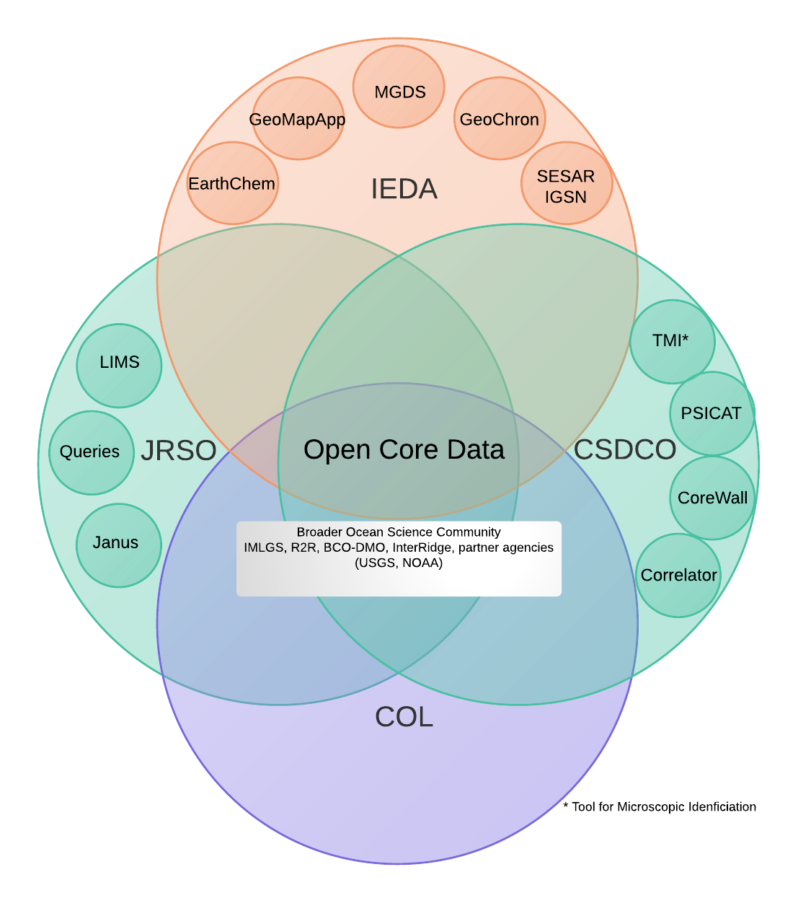
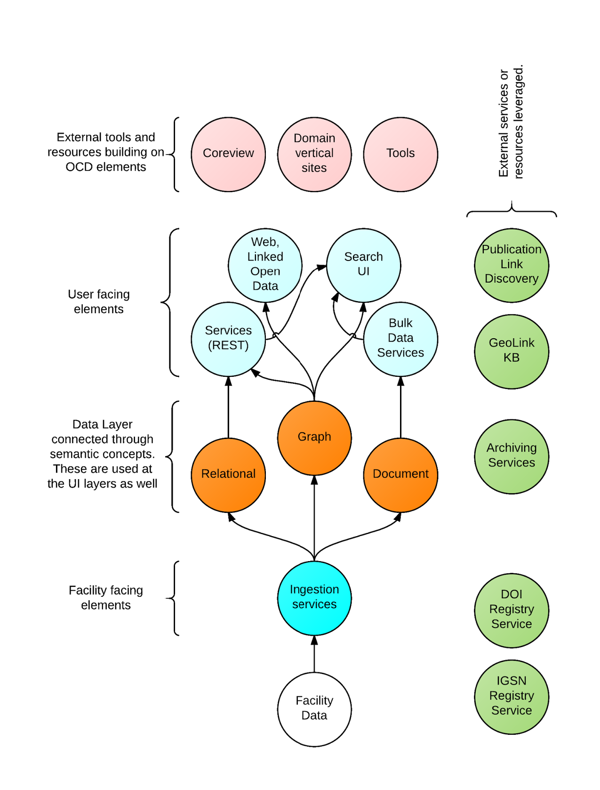
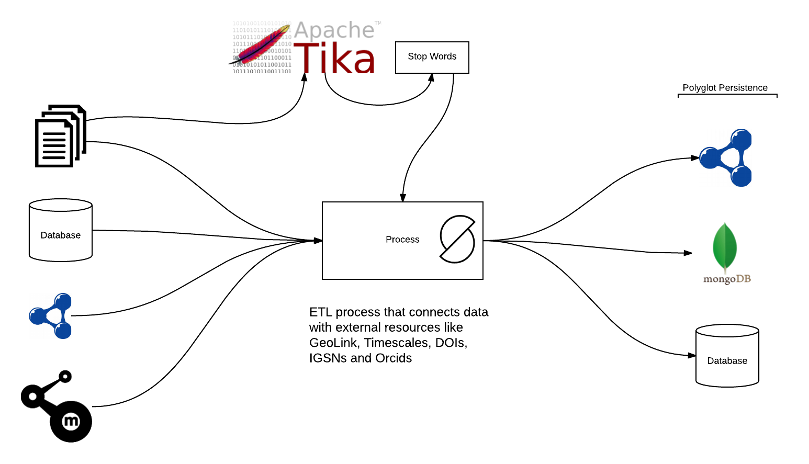
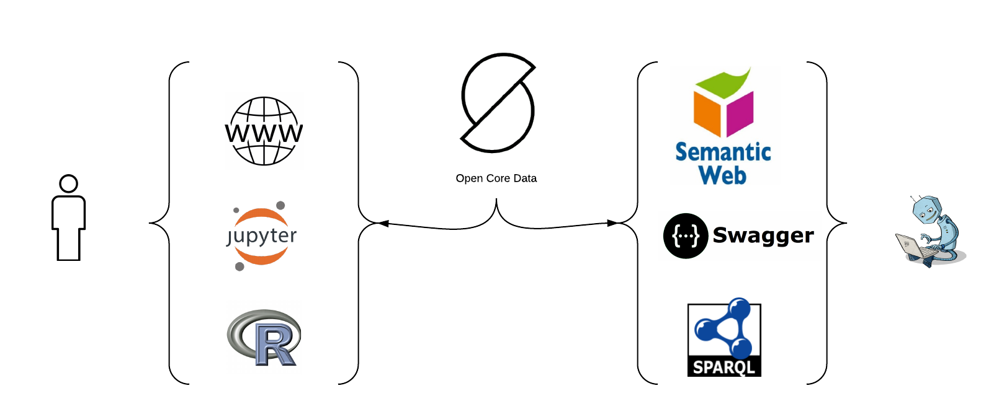
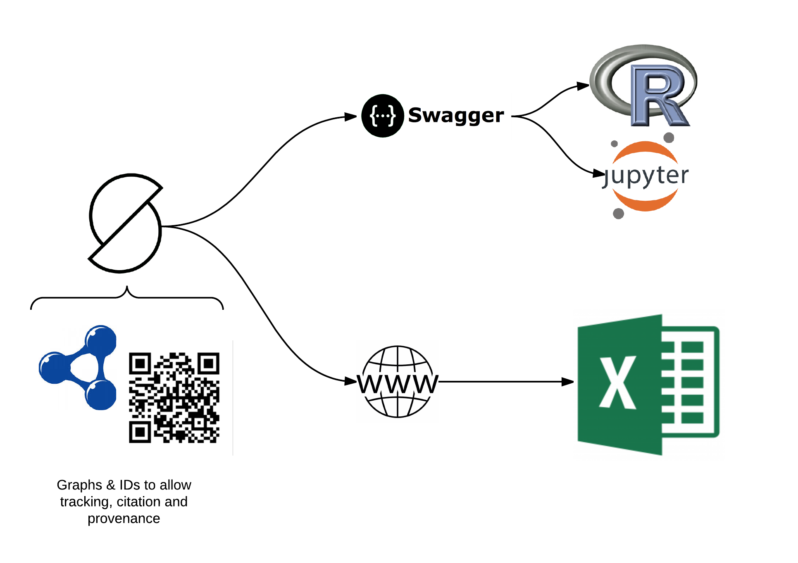
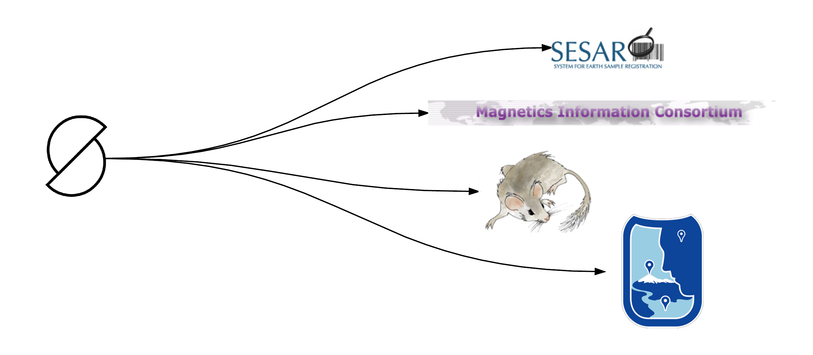

<!-- $theme: default -->
<!-- template: invert -->
<!-- page_number: true -->
<!-- footer: Talk at https://goo.gl/YFJol1 and screencast https://youtu.be/GjW_TrkUl0U -->

Open Core Data Status Update for CSDCO Nov 2016 D.C. Meeting  
===
  

##### A review of Open Core Data [opencoredata.org](http://opencoredata.org)
###### Douglas Fils ( [@fils](https://twitter.com/fils) ) 

**COL, CSDCO, IEDA, JRSO-IODP, NSF EAR-1550787, 1550887, 1550917, 1338322, 1462297, OCE-0950477**

--- 
# Outline

- **Overview of Open Core**
- **Data Flow**
- **Data Access and Use**
	- Human, machine and by other data service providers/partners

One of these things is not like the others....

---
# Over View

Open Core Data hosts meta-data and optionally raw data for CSDCO and JRSO.  This data is semantically enhanced and connected using community vocabularies and when required local vocabularies.  

---
# Data flow

---
## Getting data in
Not shown is the Bleve index (a simple KV store)

---

## Getting data out (human and machine)

Working with groups like Flyover Country, Gplates (future), Neotoma, Magic and others for using downstream data

> *Note: Bulk RDF downloads enable OCD to act as a pass through semantic enhancement (possibly via GeoLink)

---
### Expanding on *human* access methods
### Connection to existing work-flows (notebooks etc)

* Use of web based UIs and APIs to allow many approaches to the data.
* Provide citation and DOI/IGSN information

> [Notebook work](https://github.com/OpenCoreData/OpenCoreNotebooks)

---
### Expanding on *machine* access methods

[Example Landing Page](http://opencoredata.org/doc/dataset/2de213cc-ea25-435b-b46e-781bd60d9e5c)

All pages have embedded Schema.org/Dataset and [CSVW](https://www.w3.org/TR/2015/REC-tabular-data-model-20151217/) (CSV for the Web) meta-data.

Access to datasets can be obtained both via SPARQL or Linked Open Data methods or via API calls.  

Access to the CSDCO datasets is being developed under the [ocdFX](https://github.com/OpenCoreData/ocdFX) project.  Data is being indexed and meta-data and search index available in OCD.  Links to files at CSDCO or IEDA are supported. 

---
## Data distribution partners

As noted earlier in this document a key goal of Open Core Data is the exposure of OCD data holdings to 3rd parties.

This will be driven by a few keys elements

- Open data + PIDs + Provenance (W3C Prov is a key element here)
- Methods to identify data updates
- Two way connections and citation of data between partners

Early start will likely be 1 way flow out of **OCD of data with provenance**.  From there we will build out the approach.

---

## Thanks! 

### Douglas Fils

November, 2016 [Douglas Fils](https://github.com/fils)
