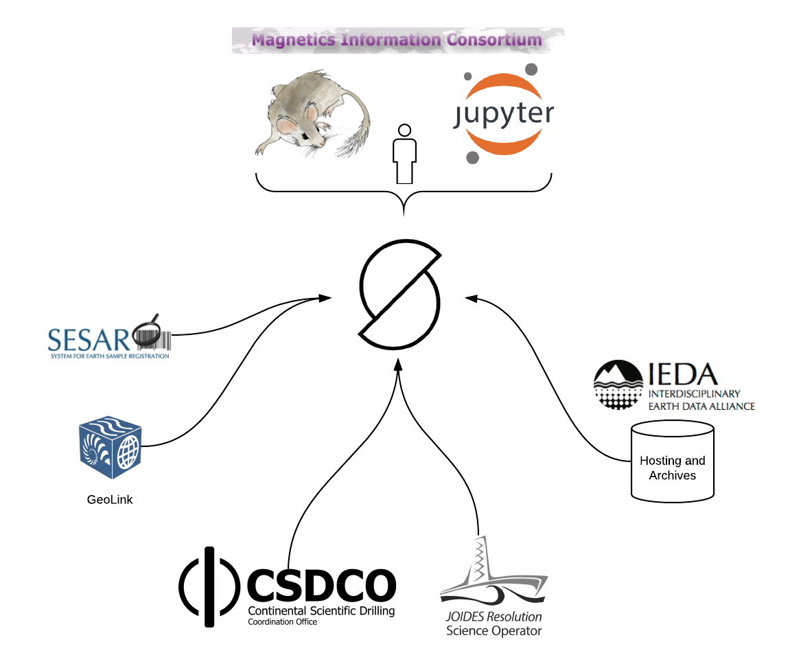
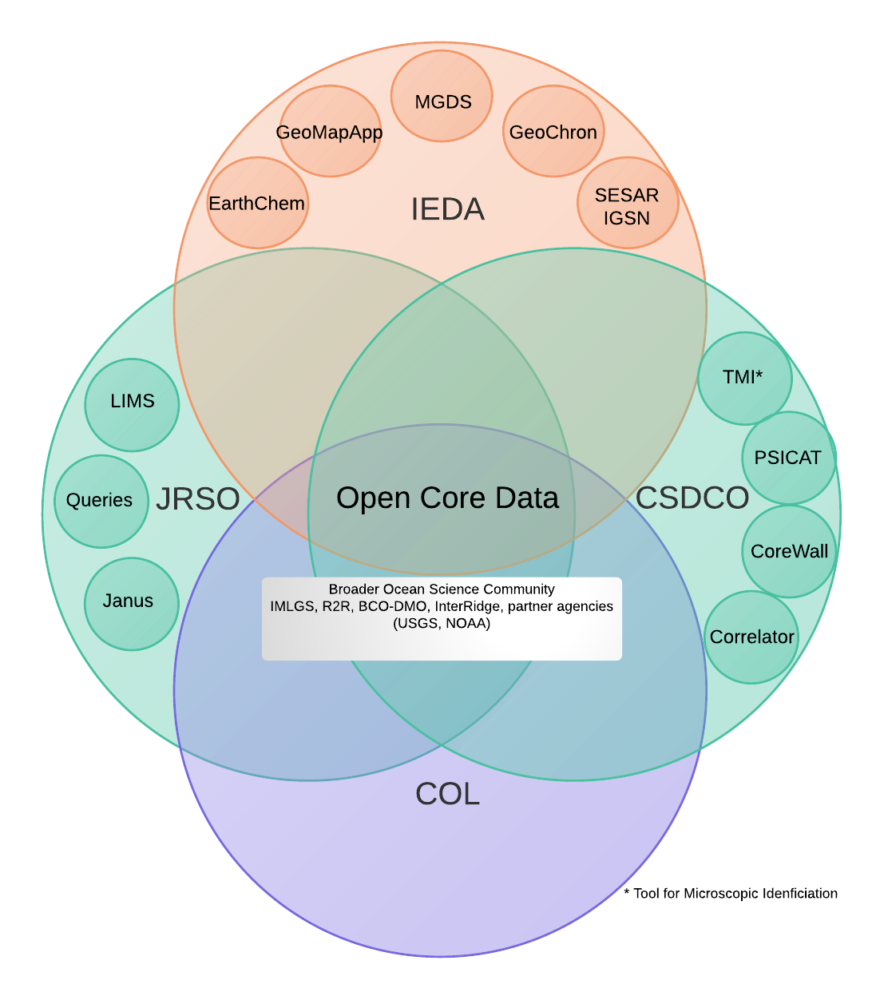
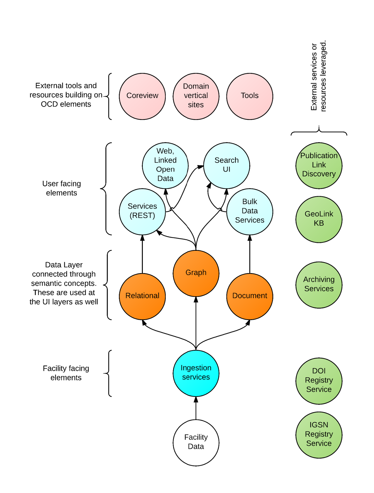
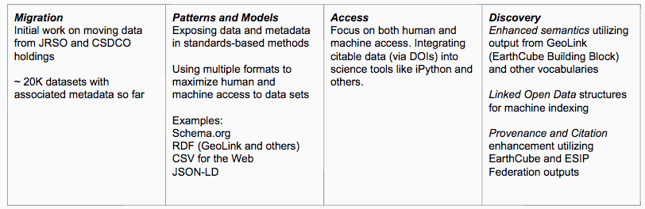
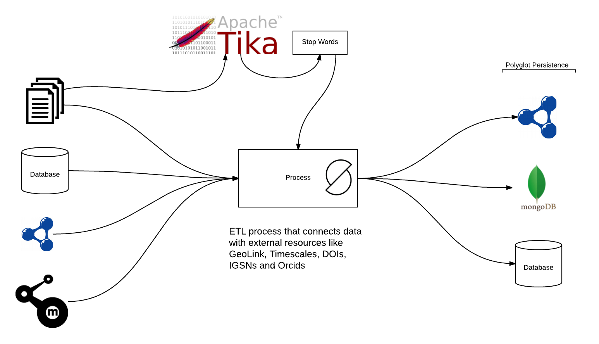
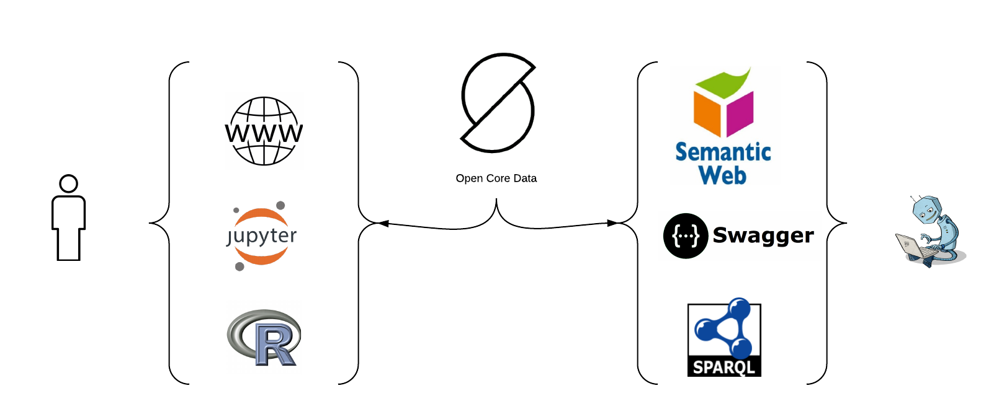

<!-- $theme: default -->
<!-- template: invert -->
<!-- page_number: true -->
<!-- footer: This presentation is at https://github.com/OpenCoreData/ocdDocumentation/tree/master/Talks/ICDP -->

Open Core Data Status Update for ICDP
===


##### A review of Open Core Data [opencoredata.org](http://opencoredata.org)
###### Douglas Fils ( [@fils](https://twitter.com/fils) )
---
# Outline

- **Overview of Open Core**
- **Review of Architecture**
	- Docker based for easy deployment and migration
	- Simple dependency approach
- **Key components  (Web, Semantic, Search, Document, API)**
- **Functional Goals**
	- Semantic connection
	- Machine access
	- Cross site referencing

> *Note: for this talk I will try to move quickly to the functional goals section*
---
# Over View

Open Core Data hosts meta-data and optionally raw data for CSDCO and JRSO.  This data is semantically enhanced and connected using community vocabularies where possible and minimal self maintained vocabularies where required.  




---
# The flow of interactions



---
# Table of functional activities

 

---
# Architecture

```md
# Docker based
All elements deploy from Docker files (most included 
at github)
Use official containers for things like Mongo and others
we can

# Golang
Development done in a modern web centric language.  

# Developed in the open; Github, Trello, Slack

# Polyglot Persistence  (all containerized)
- Triplestore (Blazegraph) for graphs
- MongoDB Mostly for core images, PDFs & other blobs  
  (some spatial use of Mongo as well)
- Relational (Janus) (and perhaps CSDCO and CHRONOS)
```
---

# Key components
Web

```html
- Linked Open Data
- HTML5 approaches including web components
- Responsive design for mobile access 
- Leaflet (and leaflet components) for maps
- Polymer and other components for UI elements
```
Semantic
```html
- Full stack semantics with use of RDF and connections to 
ontologies and vocabularies  
- Links to Geologic timescale URI's and GeoLink resources  
- Links to DOIs Orcids and IGSNs under active integration
```
---

# Key components


Search (free text)
```html
- Based on Bleve (similar to Lucene)
- Allows multi-index and faceted results.
- Low level, flexible to integrate but requires extra 
effort in the UI area. (components being developed)  
```

Document storage and API (and SPARQL)
```html
Documents stored in MongoDB (GridFS)

API in Go with Swagger definitions
The APIs are still a quickly developing aspect.  Will use a
stable, dev, beta breakdown for them.

Access to all elements of OCD.  So external sites can call for
data, free text results, or any other call used in the
site UI/UX.
```
---

## Functional Goals


| Function        | Description     
| ------------- |:-------------: 
| Semantics     | GeoLink, SKOS vocabularies connected to RDF graphs  
| Machine Access      | Micro-data (schema.org), PIDs (DOI, IGSN, Orcid), CSV for the Web (JSON-LD)   
| Cross site connections | Working to leverage the PID's and Prov to allow data to migrate across sites like Neotoma, Magic and others

> *Note: Machine access is a product of the approach and the web architecture*

> *Note: "cross site connections" are under development*

---
## Machine access

[Example Landing Page](http://opencoredata.org/doc/dataset/2de213cc-ea25-435b-b46e-781bd60d9e5c)

All pages have embedded Schema.org/Dataset and [CSVW](https://www.w3.org/TR/2015/REC-tabular-data-model-20151217/) (CSV for the Web) meta-data.

Access to datasets can be obtained both via SPARQL or Linked Open Data methods or via API calls.  

Access to the CSDCO datasets is being developed under the [ocdFX](https://github.com/OpenCoreData/ocdFX) project.  Data is being indexed and meta-data and search index available in OCD.  Links to files at CSDCO or IEDA are supported. 

---
## Cross site connections 

As noted earlier in this document a key goal of Open Core Data is the exposure of OCD data holdings to 3rd parties.

This will be driven by a few keys elements

- Open data + PIDs + Provenance (W3C Prov is a key element here)
- Methods to identify data updates
- Two way connections and citation of data between partners

Early start will likely be 1 way flow out of **OCD of data with provenance**.  From there we will build out the approach.

---
## Ingest Methods
Not shown is the Bleve index (a simple KV store)



---

## Access Methods (human and machine)

Working with groups like Flyover Country, Gplates (future), Neotoma, Magic and others for using downstream data



> *Note: Bulk RDF downloads enable OCD to act as a pass through semantic enhancement (possibly via GeoLink)

---


## Thanks! 

### Douglas Fils

November, 2016 [Douglas Fils](https://github.com/fils)
