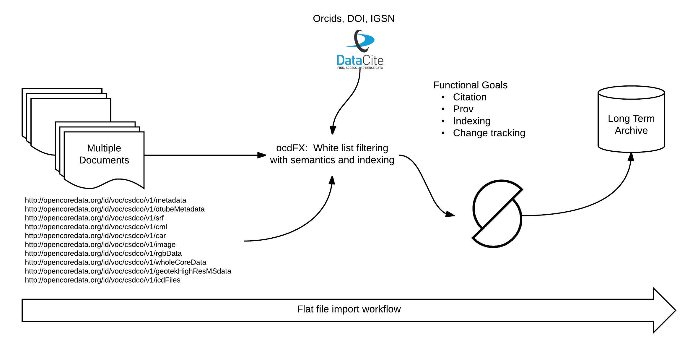

### ocdFX Flow Update

  

* ocdFX is a workflow set up with CSDCO for the indexing of the "vault".  
* It creates basic metadata that connected with the project metadata can address the creation of DataCite metadata to allow DOI assignment
* Creates a semantic connections
* Creates a free text search index
* Uses a method to allow re-organization of the "vault" by CSDCO and corrects metadata records where required
* Is a major step toward long term archiving options
* Addresses citation and prov functional goals