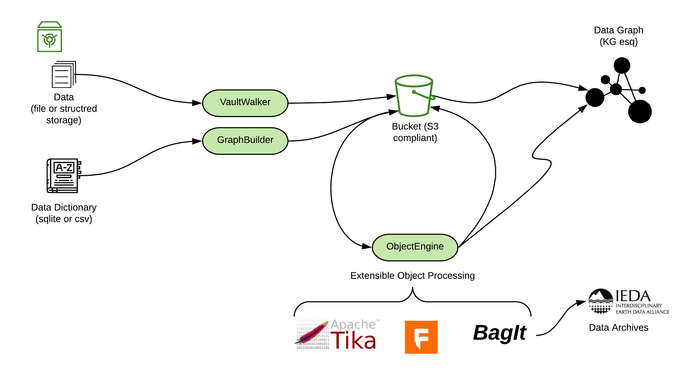

# Object Flow

## About

The primary goal for this architecture is simplicity and maintainability.  The only demands on the provider are files and a dictionary file.  

## Provider Elements

### Data

 The data is simply the data.  It's the files produced by instruments and researchers.   At the simplest level this can be stored in a files system.  Doing that requires some means to inspect and filter the files to better type them.   A more evolved system might use a document or object based approach from the start like MongoDB, Minio or others.  Doing that allows more explicate typing initially but might mean a more complex workflow for the facility lab.

### Data Dictionary

The data dictionary holds the terms and types of data a facility is exposing.  It can be a simple CSV document or a SQL based system.  The initial implementations have been CSV and sqlite3 based.   These require zero infrastructure on the facility part as both are file based and work with simple clients.   

## Flow

The following image shows the basic flow developed at Open Core.  Note more details are available about this in the main documents.  It is based on work being coordinated in the open at the Research Data Alliance (RDA).   It's also influenced by FAIR data principles and work in the EarthCube Science Support Office (ESSO) and the Earth Science Information Partners (ESIP) communities.  

At a basic level data and definitions are taken and placed into a digital object architecture.   From this another tool can take these objects and form further objects that are packages.  These packages are collections of objects as defined by the facility and or research community.  They are mostly defined as units of citation and unit of use.  Where "use" here means logical units that support scientific work-flows or archiving.  

Also, value add flows can exist such as processing the objects through tools such at Apache Tika to extract text form them.  This extracted text can then be used to aid in search and discovery.  Note, Tika is capable of extracting text from a wide range of file formats including images and video.  

The results of these processes results in a data graph.  Combined with the dictionary input this is arguably a form of knowledge graph for the contributers.  Since we can align concepts across providers, we have the foundation of distributed and semantic searching.   Additionally this work aligned with efforts such as Google Data Set Search and EarthCube Project 418/419 and Resource Registry activity.   From this many systems can index and provide discovery.  

The system is extensible so further flows could be included.  For example, a validation flow based around "graph shapes" is being developed in EarthCube that could be integrated. 

## Tools

A set of three tools are used to process the data into the object and graph systems.  They are designed around a concept that the canonical data resides in the facility data and dictionary files.  The data is transfered into the object and graph are considered mostly immutable. 

### VaultWalker

VaultWalker uses a set of "filters" defined by the data managers to select files for publications.   Files that pass this filter are then assigned a set of basic metadata to describe them.    Both these objects are then placed into the object store.  

Later the ObjectEngine loads the metadata objects into the graph system to allow query.  Based on these and other queries individual objects are available for access.

### GraphBuilder

GraphBuilders is focused on converting the data dictionary into a machine readable graph.  It loads the terms, concepts and instances of concepts present in the dictionary into the graph.

This allows these elements to be associated with the digital objects.   These facility resources are also then blended into the graph along side the object metadata to aid in search and retrieval. 

### ObjectEngine 

The role of ObjectEngine

## Table of Types

A review of the ID flow through the DOA

| Package                          | type        | bucket      | ID       | Path     | Mutable | Notes                    |
| -------------------------------- | ----------- | ----------- | -------- | -------- | ------- | ------------------------ |
| VaultWalker: File                | byte stream | do          | sha256   | id/do/ID | n       |                          |
| VaultWalker: File metadata       | data graph  | do-meta     | XID'     | id/ID    | y       | object metadata          |
| GraphBuilder: Project            | data graph  | do-resource | XID''    | id/ID    | y       | or use projname (issues) |
| GraphBuilder: Borehole           | data graph  | do-resource | XID''' ? | id/ID    | y       | or use holeID? or IGSN?  |
| ObjectEngine: Tika               | data graph  | do-tika     | XID'     | id/ID    | y       | add to VW file metadata  |
| ObjectEngine: Package (bstream)  | data graph  | do          | sha256   | id/do/ID | n       | package is immutable ?   |
| ObjectEngine: Package (metadata) | data graph  | do-meta     | XID''''  | id/ID    | y       | package metadata         |

## PID Value methods

For most of these IDs above I am using XID.  However, it's not deterministic, so it's hard to rebuild the DOs later and maintain their IDs.   We would need to pull the ID, rebuild the object and store it over the old object.   

However, for the Project and Borehole we could use the a SHA256 of the Project name and Hole ID.  These name strings should not change (though the package is mutable) and if they did it would indicate a major change in the objects reference.

## Appendix

### Bucket convention

Reference the table of types for now.   A more detailed implementation pattern should be described here for the bucket naming convention.